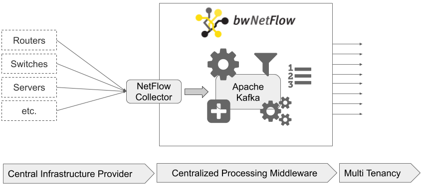

# bwNetFlow - Open Source Network Flow Analysis Suite

The bwNetFlow suite uses existing software and provides
glue code to allow for large scale network flow analysis.

bwNetFlow uses [GoFlow](https://github.com/cloudflare/goflow) and
[Apache Kafka](https://kafka.apache.org/) to process network flow via NetFlow and Kafka.

We provide a set of tools working with Kafka as consumers and/or producers
to establish a flow monitoring analysis pipeline. While these tools can be combined 
in any specific way, the core components and wiring in our use case is as follows:

- **GoFlow:** Cloudflare's [GoFlow](https://github.com/cloudflare/goflow) receives NetFlow and produces protobuf messages in Kafka topic *input*
- **Enricher:** reads from Kafka topic *input*, adds domain specific knowlege (customer, direction, device info, etc), and writes protobuf messages in Kafka topic *enriched*
- **Splitter:** reads from Kafka topic *enriched*, writes into customer specific topics *enriched-$cid* for each enabled customer
- **Dashboard:** reads from Kafka topic *enriched*, aggregates the flows to counters and writes these counter values to a Time Series Database (InfluxDB or Prometheus)

The tools work with Protobuf messages for representing NetFlow packets from
GoFlow - yet with an [extended protobuf message](https://github.com/bwNetFlow/protobuf) as soon as enriched by the enricher component. 

Other Tools:

- **<a href="https://github.com/bwNetFlow/protobuf_to_netflow_converter" target="_blank">protobuf_to_netflow_converter</a>:** Converts all incoming protobuf decoded messages into NetFlow v9 compliant messages.
- **<a href="https://github.com/bwNetFlow/python-consumers" target="_blank">consumer examples</a>:** various detectors, SQLite dumper, ...
- **<a href="https://github.com/bwNetFlow/protobuf_to_csv_converter" target="_blank">protobuf_to_csv_converter</a>:** Writes all incoming protobuf decoded messages into csv files. The specific protobuf fields can be completely user specified.
- **<a href="https://github.com/bwNetFlow/bwnetflow_dosdetection" target="_blank">bwnetflow_dosdetection</a>:** Provides a sample volume-based DoS Detection implementation based on protobuf converted NetFlow data.
- **<a href="https://github.com/bwNetFlow/NetFlow_NEMEA_Toolchain" target="_blank">NetFlow_NEMEA_Toolchain</a>:** Provies an example how the bwNetFlow NetFlow v9 exporter and the NEMEA framework can be chained. This can be applied similarly to all other available NEMEA modules.
- **<a href="https://github.com/bwNetFlow/processor_reducer" target="_blank">processor_reducer</a>:** This is a small Kafka Processor, i.e. a Consumer and a Producer, which supports reducing Protobuf messages to a specific subset of fields. 

To develop Kafka consumers/producers with Go the [kafkaconnector](https://github.com/bwNetFlow/kafkaconnector) library abstracts most of the recurrent code fragments.
To develop Kafka consumers/producers with C++ the [cpp_kafkaconnector](https://github.com/bwNetFlow/cpp_kafkaconnector) library abstracts most of the recurrent code fragments.

## Deployment

For deploying the bwNetFlow suite we provide Ansible scripts or Docker / Docker-Compose description. The processing side requires a Kafka cluster with a number of topics arranged to the individual needs. A typical pipeline is a topic fed by goflow, which is read and rewritten to an additional topic by the enricher, which is in turn splitted into tenant-specific topics using the splitter component. The consuming side is availible here: https://github.com/bwNetFlow/demo
